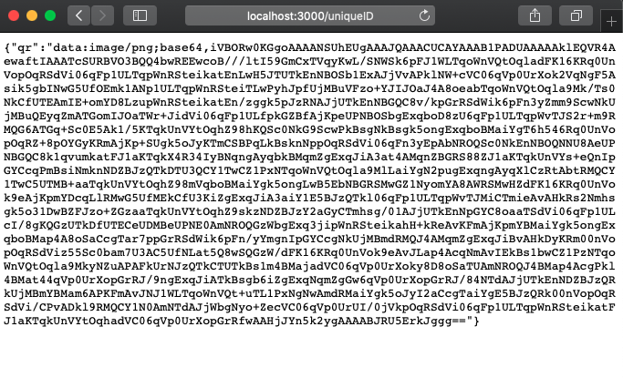
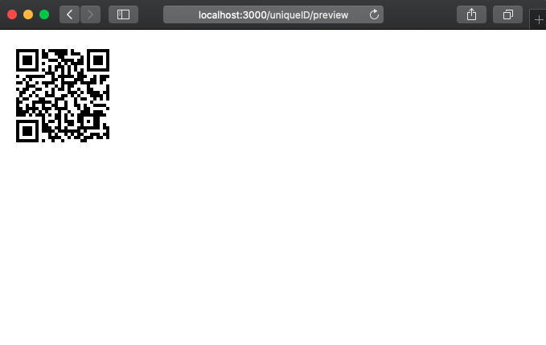

QR Code generator for [node](http://nodejs.org).

```js
const express = require('express');
const qrcode = require('qrcode');

const app = express();
const port = 3000;

const baseUrl = `http://localhost:${port}`;

const urlGenerator = (id) => {
    return `${baseUrl}/scan/${id}`;
}

/**
 * Given an unique ID returns a base64 QR code pointing to that ID.
 */
app.get('/:id', (req, res) => { 
    qrcode.toDataURL(urlGenerator(req.params['id'])).then(qr => { 
        res.json({
            qr
        })
    })
})

/**
 * Given an unique ID renders a QR code pointing to that ID
 */
app.get('/:id/preview', (req, res) => { 
    qrcode.toDataURL(urlGenerator(req.params['id'])).then(qr => { 
        res.send(``)
    })
})

/**
 * URL for reading the QR generated routes.
 */
app.get('/scan/:id', (req, res) => {
    res.send(`You're ID is: ${req.params['id']}`);
})

app.listen(port, () => console.log(`QR Generator available. http://localhost:3000/:id for base64 and http://localhost:3000/:id/preview to get the image.`))
```

## Installation

`npm install`

## Run

`node index.js`

## Usage

Visit http://localhost:3000/randomString to get a base64 QR code that points to: http://localhost:3000/scan/randomString



Visit http://localhost:3000/randomString/preview to get a QR code that points to: http://localhost:3000/scan/randomString


